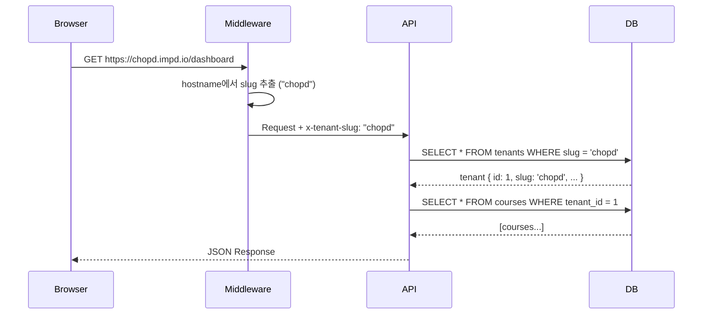
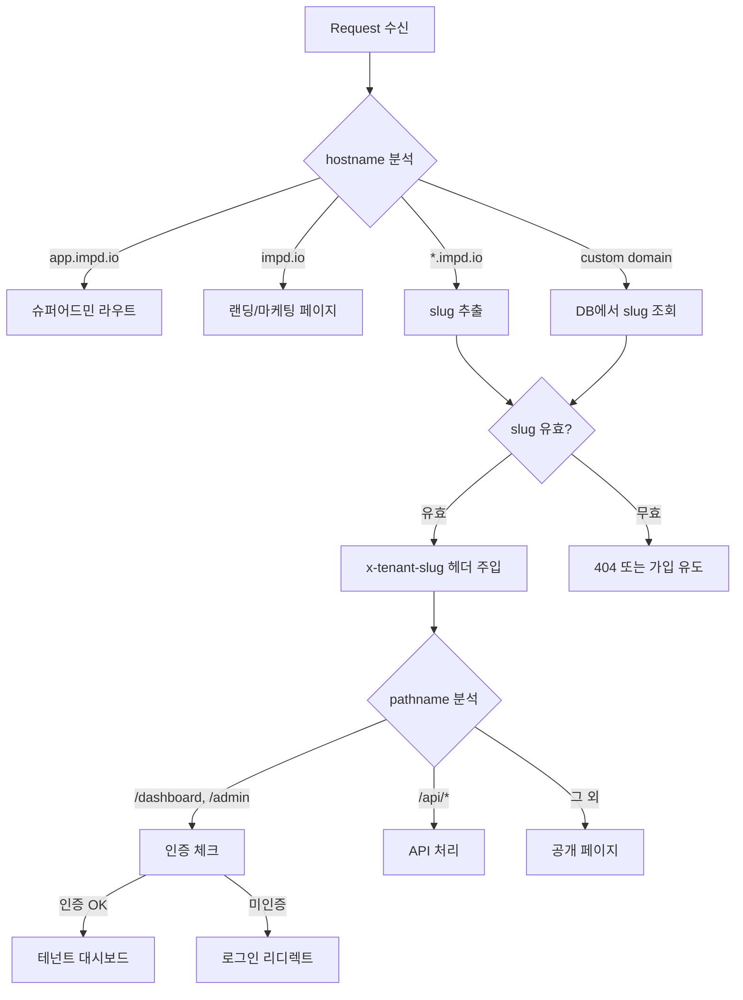
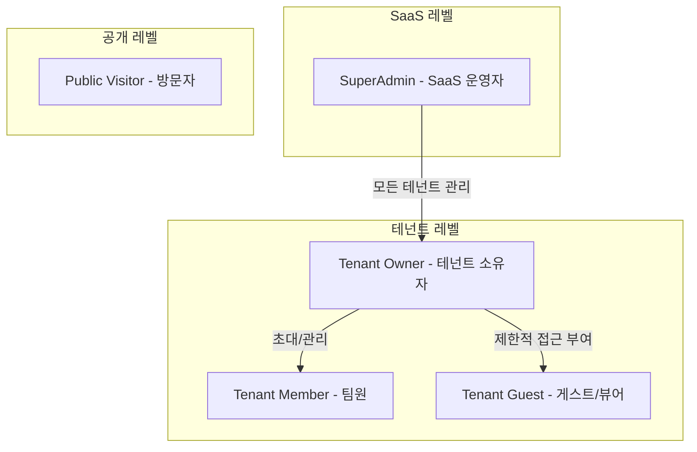
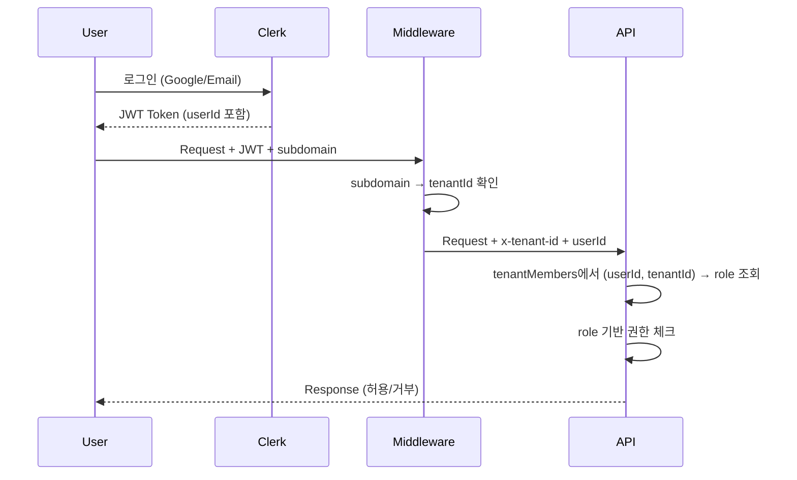
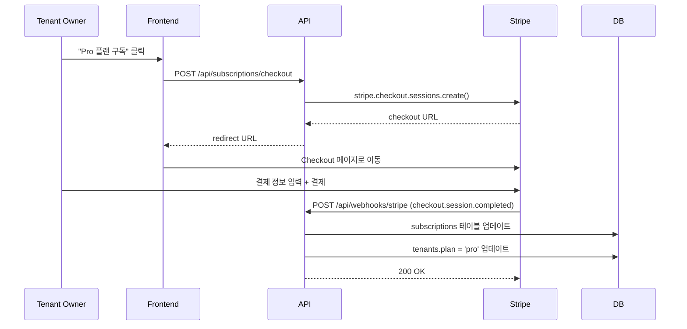

# 01. SaaS 전환 아키텍처 설계서

## 1. 개요

imPD를 최PD 전용 플랫폼에서 **개인사업자/프리랜서 범용 SaaS**로 전환한다.
핵심 전략은 **단일 DB + tenant_id 패턴**의 멀티테넌시이며, 기존 68개 테이블과 110개 API를 최소한의 breaking change로 확장한다.

### 설계 원칙
1. **기존 코드 보존**: 새 테이블 추가 + 기존 테이블에 `tenantId` 컬럼만 추가
2. **점진적 마이그레이션**: 기존 데이터는 `default` 테넌트로 자동 귀속
3. **테넌트 격리**: 모든 쿼리에 `WHERE tenant_id = ?` 자동 주입
4. **직업군 커스터마이징**: i18n JSON 패턴 (코드 변경 없이 UI 용어 전환)

---

## 2. 멀티테넌시 아키텍처

### 2.1 테넌시 모델: 단일 DB + Row-Level Isolation

```
선택 이유:
- SQLite 단일 파일 → DB 분리 불가 (PostgreSQL 스키마 분리도 불가)
- Row-Level Isolation이 SQLite에서 유일하게 실용적인 패턴
- Drizzle ORM의 .where() 체이닝으로 자연스럽게 구현 가능
```

### 2.2 테넌트 식별 흐름



### 2.3 테넌트 컨텍스트 전파

미들웨어에서 테넌트를 식별하고 API까지 전파하는 흐름:

```
1. 미들웨어: hostname → slug 추출 → request header에 x-tenant-id 주입
2. API Route: header에서 tenant_id 읽기 → 모든 쿼리에 적용
3. 유틸리티: getTenantFromRequest(req) 헬퍼 함수 제공
```

---

## 3. 서브도메인 라우팅 전략

### 3.1 URL 패턴

| 패턴 | 대상 | 예시 |
|------|------|------|
| `{slug}.impd.io` | 테넌트 공개 페이지 | `chopd.impd.io`, `kimrealtor.impd.io` |
| `{slug}.impd.io/dashboard` | 테넌트 소유자 대시보드 | `chopd.impd.io/dashboard` |
| `{slug}.impd.io/admin` | 테넌트 어드민 | `chopd.impd.io/admin` |
| `app.impd.io` | SaaS 슈퍼어드민 | 운영자 전용 |
| `impd.io` | 랜딩 페이지 (마케팅) | 가입 유도 |
| `custom-domain.com` | 커스텀 도메인 (Pro+) | CNAME → `{slug}.impd.io` |

### 3.2 미들웨어 확장 설계



### 3.3 기존 미들웨어와의 호환

**현재 미들웨어 구조 유지**: `chopd.*` 서브도메인 처리 로직이 이미 있으므로, 이를 일반화한다.

```
변경 전: if (hostname.startsWith('chopd.'))  → /chopd prefix rewrite
변경 후: slug = extractSlug(hostname) → /t/{slug} prefix rewrite (또는 헤더 주입)
```

**기존 `/chopd`, `/pd`, `/admin` 라우트는 유지**하되, 테넌트 컨텍스트 아래에서 동작하도록 래핑한다.

---

## 4. i18n 패턴 (직업군별 JSON 커스터마이징)

### 4.1 구조

```
src/lib/i18n/
  ├── base.json          # 기본 용어 (fallback)
  ├── professions/
  │   ├── pd.json         # PD/방송인
  │   ├── shopowner.json  # 쇼핑몰 운영자
  │   ├── realtor.json    # 부동산 중개인
  │   ├── educator.json   # 교육자/강사
  │   ├── insurance.json  # 보험 설계사
  │   └── freelancer.json # 프리랜서
  └── index.ts            # 로더 + 머지 로직
```

### 4.2 JSON 구조 예시

```json
// base.json (기본)
{
  "nav": {
    "home": "홈",
    "education": "교육",
    "media": "미디어",
    "works": "작품",
    "community": "커뮤니티"
  },
  "dashboard": {
    "title": "대시보드",
    "courses": "교육 과정",
    "inquiries": "문의",
    "subscribers": "구독자"
  },
  "distributor": {
    "title": "유통사",
    "singular": "유통사",
    "plural": "유통사 목록"
  }
}

// professions/shopowner.json (쇼핑몰)
{
  "nav": {
    "education": "상품 교육",
    "works": "상품 갤러리"
  },
  "dashboard": {
    "courses": "상품 교육",
    "inquiries": "고객 문의"
  },
  "distributor": {
    "title": "대리점",
    "singular": "대리점",
    "plural": "대리점 목록"
  }
}
```

### 4.3 런타임 용어 해석

```
1. 테넌트의 profession 필드 참조
2. professions/{profession}.json 로드
3. base.json과 deep merge (profession이 우선)
4. React Context로 전달 → useLabel('distributor.title') 호출
```

---

## 5. 인증/인가 흐름

### 5.1 역할 체계



### 5.2 역할별 권한 매트릭스

| 리소스 | SuperAdmin | Tenant Owner | Member | Guest | Public |
|--------|-----------|-------------|--------|-------|--------|
| 모든 테넌트 목록 | CRUD | - | - | - | - |
| 자기 테넌트 설정 | CRUD | CRUD | R | - | - |
| 콘텐츠 (과정, 포스트) | CRUD | CRUD | CRU | R | R(공개만) |
| 유통사 관리 | CRUD | CRUD | R | - | - |
| 구독/결제 | CRUD | RU | - | - | - |
| 분석 대시보드 | R(전체) | R(자기) | R(자기) | - | - |
| 히어로/프로필 | CRUD | CRUD | - | - | R |

### 5.3 Clerk 연동 확장

```
현재: Clerk userId → adminUsers 테이블 조회 → 역할 결정
변경: Clerk userId → tenantMembers 테이블 조회 → (tenantId, role) 결정

Clerk 메타데이터 활용:
- publicMetadata.tenantId: 기본 테넌트 ID
- publicMetadata.role: 테넌트 내 역할
- privateMetadata.isSuperAdmin: SaaS 운영자 여부
```

### 5.4 인증 흐름



---

## 6. 구독/결제 아키텍처 (Stripe)

### 6.1 플랜 구조

| 플랜 | 월 가격 | 테넌트 수 | SNS 계정 | 저장공간 | 커스텀 도메인 | 팀원 |
|------|---------|----------|---------|---------|-------------|------|
| Free | 0원 | 1 | 2 | 500MB | X | 0 |
| Pro | 29,000원 | 1 | 10 | 5GB | O | 3 |
| Enterprise | 99,000원 | 1 | 무제한 | 50GB | O | 무제한 |

### 6.2 Stripe 연동 흐름



### 6.3 기능 제한 (Feature Gating)

```
// 미들웨어/API 레벨에서 체크
const limits = getPlanLimits(tenant.plan);

if (tenant.snsAccountCount >= limits.maxSnsAccounts) {
  return { error: 'SNS 계정 수 한도 초과. 플랜을 업그레이드하세요.' };
}
```

---

## 7. 기존 코드 확장 전략

### 7.1 확장 원칙: "래핑, 교체 아님"

기존 라우트와 컴포넌트를 제거하지 않고, 테넌트 컨텍스트 레이어를 추가한다.

### 7.2 라우트 변경 계획

#### 현재 라우트 → SaaS 전환 후

| 현재 | 전환 후 | 변경 내용 |
|------|---------|----------|
| `/chopd/*` | `{slug}.impd.io/*` | 테넌트별 공개 페이지 (chopd는 기본 테넌트) |
| `/admin/*` | `{slug}.impd.io/admin/*` | 테넌트 어드민 (기존 유통 관리) |
| `/pd/*` | `{slug}.impd.io/dashboard/*` | 테넌트 소유자 대시보드 |
| `/member/[slug]` | `{slug}.impd.io` | 서브도메인으로 대체 (레거시 유지) |
| (신규) | `app.impd.io/*` | SaaS 슈퍼어드민 |
| (신규) | `impd.io` | 마케팅 랜딩 페이지 |

#### 새로 추가되는 라우트

```
/app/superadmin/          # SaaS 운영자 대시보드
  ├── dashboard/          # 전체 테넌트 현황
  ├── tenants/            # 테넌트 관리 (CRUD)
  ├── subscriptions/      # 구독 현황
  ├── analytics/          # 플랫폼 전체 분석
  └── settings/           # SaaS 설정

/app/onboarding/          # 신규 테넌트 온보딩
  ├── step1-profile/      # 프로필 설정
  ├── step2-profession/   # 직업군 선택
  ├── step3-branding/     # 브랜딩 설정
  └── step4-plan/         # 플랜 선택
```

### 7.3 컴포넌트 변경 계획

| 컴포넌트 | 변경 유형 | 설명 |
|---------|----------|------|
| `Header.tsx` | 수정 | 테넌트 브랜딩 (로고, 색상) 반영 |
| `Footer.tsx` | 수정 | 테넌트 정보 반영 |
| `LayoutShell.tsx` | 수정 | 테넌트 Context Provider 래핑 |
| `HeroSection.tsx` | 수정 | 테넌트별 히어로 이미지 |
| `TenantProvider.tsx` | 신규 | 테넌트 컨텍스트 제공 |
| `PlanGate.tsx` | 신규 | 플랜별 기능 잠금 UI |
| `OnboardingWizard.tsx` | 신규 | 온보딩 플로우 |
| `SuperAdminLayout.tsx` | 신규 | 슈퍼어드민 레이아웃 |

### 7.4 API 확장 전략

모든 기존 API에 테넌트 필터를 추가하되, 기존 함수 시그니처는 유지한다.

```
변경 전: GET /api/courses → db.select().from(courses)
변경 후: GET /api/courses → db.select().from(courses).where(eq(courses.tenantId, ctx.tenantId))
```

이를 위해 **쿼리 빌더 래퍼**를 도입한다:

```
// withTenant(query, tenantId) 유틸리티
// 모든 select/insert/update/delete에 tenantId 조건 자동 주입
```

---

## 8. 전체 시스템 아키텍처

```mermaid
graph TB
    subgraph "클라이언트"
        B1[chopd.impd.io<br/>테넌트 A 공개]
        B2[kimrealtor.impd.io<br/>테넌트 B 공개]
        B3[app.impd.io<br/>슈퍼어드민]
        B4[impd.io<br/>마케팅 랜딩]
    end

    subgraph "Next.js App (단일 배포)"
        MW[Middleware<br/>서브도메인 → tenantId]

        subgraph "라우트 그룹"
            R1[/chopd/* 공개 페이지]
            R2[/admin/* 테넌트 어드민]
            R3[/dashboard/* 소유자 대시보드]
            R4[/superadmin/* SaaS 관리]
            R5[/onboarding/* 신규 가입]
        end

        subgraph "API Routes"
            API[/api/* <br/> tenantId 필터 자동 적용]
        end

        subgraph "공통 레이어"
            TC[TenantContext<br/>테넌트 정보 + 라벨]
            I18N[i18n Loader<br/>직업군별 JSON]
            PG[PlanGate<br/>기능 제한 체크]
        end
    end

    subgraph "외부 서비스"
        CL[Clerk<br/>인증]
        ST[Stripe<br/>결제]
        S3[Storage<br/>파일 저장]
    end

    subgraph "데이터"
        DB[(SQLite<br/>tenant_id 기반 격리)]
    end

    B1 & B2 --> MW
    B3 --> MW
    B4 --> MW
    MW --> R1 & R2 & R3 & R4 & R5
    R1 & R2 & R3 & R4 --> API
    API --> TC --> DB
    API --> PG
    TC --> I18N
    API --> CL
    API --> ST
    API --> S3
```

---

## 9. 마이그레이션 단계 (Phase 계획)

### Phase 1: 기반 (2주)
- `tenants`, `tenantMembers`, `saasSubscriptions` 테이블 추가
- 기존 테이블에 `tenantId` 컬럼 추가 (nullable, default='1')
- 기본 테넌트(id=1, slug='chopd') 생성 → 기존 데이터 귀속
- `getTenantFromRequest()` 유틸리티 작성
- 미들웨어 서브도메인 일반화

### Phase 2: 테넌트 격리 (2주)
- 모든 API에 tenantId 필터 적용
- TenantProvider 컨텍스트 추가
- i18n JSON 구조 + 로더 구현
- 온보딩 플로우 구현

### Phase 3: 결제 (1주)
- Stripe 연동
- 구독 관리 API
- PlanGate 컴포넌트
- 웹훅 핸들러

### Phase 4: 슈퍼어드민 (1주)
- 슈퍼어드민 대시보드
- 테넌트 관리 CRUD
- 플랫폼 분석

### Phase 5: 안정화 (1주)
- E2E 테스트
- 성능 최적화 (인덱스, 캐싱)
- 커스텀 도메인 SSL 자동화

---

## 10. 성능 고려사항

### 10.1 SQLite 확장성 한계

SQLite는 동시 쓰기가 제한적이다. 테넌트 수가 100개를 초과하면:
- **WAL 모드 필수**: `PRAGMA journal_mode=WAL` (이미 LibSQL에서 기본)
- **읽기 복제본**: Turso의 Edge Replica 활용
- **궁극적 전환**: PostgreSQL + Row-Level Security (RLS) 마이그레이션 대비

### 10.2 인덱스 전략

tenant_id가 추가되는 모든 테이블에 복합 인덱스 필수:
- `(tenant_id, id)` — 기본 조회
- `(tenant_id, created_at)` — 시간순 조회
- `(tenant_id, status)` — 상태별 필터

### 10.3 캐싱

- 테넌트 정보: 미들웨어에서 LRU 캐시 (slug → tenantId, TTL 5분)
- 플랜 제한: 메모리 캐시 (planId → limits, TTL 1시간)
- i18n JSON: 빌드 타임 번들링 (런타임 IO 제거)

---

## 11. 보안 고려사항

1. **테넌트 간 데이터 유출 방지**: 모든 쿼리에 tenantId 필터 누락 체크 (lint rule)
2. **API Rate Limiting**: 테넌트별 + 플랜별 Rate Limit
3. **Stripe Webhook 검증**: 서명 검증 필수
4. **커스텀 도메인 SSL**: Let's Encrypt 자동 발급 (Caddy/Traefik)
5. **SuperAdmin 접근**: IP 화이트리스트 + 2FA 필수
