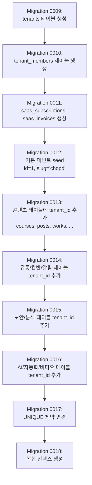
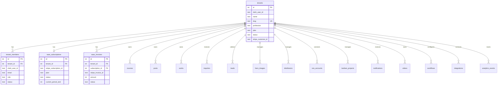

# 03. DB 스키마 변경 설계서

## 1. 개요

기존 68개 테이블 + 회원/챗봇 관련 테이블을 분석하여, SaaS 멀티테넌시 전환에 필요한 스키마 변경을 정의한다.

### 핵심 원칙
1. **신규 테이블 3개 추가**: `tenants`, `tenantMembers`, `saasSubscriptions`
2. **기존 테이블에 `tenant_id` 추가**: 테넌트별 데이터 격리가 필요한 테이블만
3. **기존 테이블 재활용**: `organizations` → `tenants`로 역할 전환 (스키마 유지, 의미 확장)
4. **마이그레이션 안전성**: `tenant_id`는 nullable + default(1)로 추가 → 기존 데이터 무중단

---

## 2. 신규 테이블

### 2.1 `tenants` — 테넌트 (핵심)

```sql
CREATE TABLE tenants (
  id            INTEGER PRIMARY KEY AUTOINCREMENT,
  clerk_user_id TEXT NOT NULL,                    -- 소유자 Clerk ID
  name          TEXT NOT NULL,                    -- 테넌트 이름
  slug          TEXT NOT NULL UNIQUE,             -- 서브도메인 slug
  profession    TEXT NOT NULL DEFAULT 'freelancer', -- pd | shopowner | realtor | educator | insurance | freelancer
  business_type TEXT NOT NULL DEFAULT 'individual', -- individual | company | organization
  region        TEXT,                             -- 지역
  status        TEXT NOT NULL DEFAULT 'active',   -- active | suspended | deleted | pending
  plan          TEXT NOT NULL DEFAULT 'free',     -- free | pro | enterprise
  -- 브랜딩
  logo_url      TEXT,
  favicon_url   TEXT,
  primary_color TEXT DEFAULT '#3b82f6',
  secondary_color TEXT DEFAULT '#8b5cf6',
  font_family   TEXT DEFAULT 'Inter',
  custom_domain TEXT,                             -- Pro+ 전용
  -- 제한
  max_storage   INTEGER DEFAULT 524288000,        -- 500MB (Free)
  used_storage  INTEGER DEFAULT 0,
  -- Stripe
  stripe_customer_id    TEXT,
  stripe_subscription_id TEXT,
  -- 메타
  settings      TEXT,                             -- JSON: 추가 설정
  metadata      TEXT,                             -- JSON: 추가 데이터
  deleted_at    INTEGER,                          -- 소프트 딜리트 (timestamp)
  created_at    INTEGER DEFAULT (unixepoch()) NOT NULL,
  updated_at    INTEGER DEFAULT (unixepoch()) NOT NULL
);

CREATE UNIQUE INDEX idx_tenants_slug ON tenants(slug);
CREATE INDEX idx_tenants_clerk_user ON tenants(clerk_user_id);
CREATE INDEX idx_tenants_status ON tenants(status);
CREATE INDEX idx_tenants_plan ON tenants(plan);
CREATE INDEX idx_tenants_custom_domain ON tenants(custom_domain);
```

**기존 `organizations` 테이블과의 관계**: `organizations`는 엔터프라이즈 기능(팀, SSO 등)에 사용되므로 유지한다. 테넌트가 Enterprise 플랜이면 `organizations`에 연결할 수 있도록 `tenants.organization_id` 옵션 필드를 고려하되, Phase 1에서는 제외한다.

### 2.2 `tenant_members` — 테넌트 멤버

```sql
CREATE TABLE tenant_members (
  id          INTEGER PRIMARY KEY AUTOINCREMENT,
  tenant_id   INTEGER NOT NULL REFERENCES tenants(id) ON DELETE CASCADE,
  clerk_user_id TEXT NOT NULL,                    -- Clerk user ID
  email       TEXT NOT NULL,
  name        TEXT,
  role        TEXT NOT NULL DEFAULT 'member',     -- owner | admin | member | guest
  status      TEXT NOT NULL DEFAULT 'invited',    -- invited | active | suspended | removed
  invited_by  TEXT,                               -- Clerk user ID
  invited_at  INTEGER,
  joined_at   INTEGER,
  last_active_at INTEGER,
  permissions TEXT,                               -- JSON: 세분화된 권한 (향후 확장)
  metadata    TEXT,                               -- JSON
  created_at  INTEGER DEFAULT (unixepoch()) NOT NULL,
  updated_at  INTEGER DEFAULT (unixepoch()) NOT NULL
);

CREATE UNIQUE INDEX idx_tenant_members_unique ON tenant_members(tenant_id, clerk_user_id);
CREATE INDEX idx_tenant_members_tenant ON tenant_members(tenant_id);
CREATE INDEX idx_tenant_members_user ON tenant_members(clerk_user_id);
CREATE INDEX idx_tenant_members_email ON tenant_members(email);
```

### 2.3 `saas_subscriptions` — SaaS 구독 (Stripe 연동)

```sql
CREATE TABLE saas_subscriptions (
  id                      INTEGER PRIMARY KEY AUTOINCREMENT,
  tenant_id               INTEGER NOT NULL REFERENCES tenants(id) ON DELETE CASCADE,
  stripe_subscription_id  TEXT UNIQUE,
  stripe_customer_id      TEXT NOT NULL,
  stripe_price_id         TEXT NOT NULL,
  plan                    TEXT NOT NULL,           -- free | pro | enterprise
  billing_period          TEXT NOT NULL DEFAULT 'monthly', -- monthly | yearly
  status                  TEXT NOT NULL DEFAULT 'active',  -- active | past_due | canceled | trialing | unpaid
  current_period_start    INTEGER,
  current_period_end      INTEGER,
  cancel_at_period_end    INTEGER DEFAULT 0,       -- boolean
  canceled_at             INTEGER,
  trial_start             INTEGER,
  trial_end               INTEGER,
  metadata                TEXT,                    -- JSON
  created_at              INTEGER DEFAULT (unixepoch()) NOT NULL,
  updated_at              INTEGER DEFAULT (unixepoch()) NOT NULL
);

CREATE UNIQUE INDEX idx_saas_sub_tenant ON saas_subscriptions(tenant_id);
CREATE INDEX idx_saas_sub_stripe ON saas_subscriptions(stripe_subscription_id);
CREATE INDEX idx_saas_sub_status ON saas_subscriptions(status);
```

### 2.4 `saas_invoices` — SaaS 인보이스 (Stripe 연동)

```sql
CREATE TABLE saas_invoices (
  id                  INTEGER PRIMARY KEY AUTOINCREMENT,
  tenant_id           INTEGER NOT NULL REFERENCES tenants(id) ON DELETE CASCADE,
  subscription_id     INTEGER REFERENCES saas_subscriptions(id),
  stripe_invoice_id   TEXT UNIQUE,
  amount              INTEGER NOT NULL,           -- 센트 단위
  currency            TEXT DEFAULT 'krw' NOT NULL,
  status              TEXT NOT NULL,              -- draft | open | paid | void | uncollectible
  invoice_pdf_url     TEXT,
  hosted_invoice_url  TEXT,
  period_start        INTEGER,
  period_end          INTEGER,
  paid_at             INTEGER,
  created_at          INTEGER DEFAULT (unixepoch()) NOT NULL
);

CREATE INDEX idx_saas_invoices_tenant ON saas_invoices(tenant_id);
CREATE INDEX idx_saas_invoices_status ON saas_invoices(status);
```

---

## 3. 기존 테이블 변경: `tenant_id` 추가 대상

### 3.1 tenant_id 추가가 필요한 테이블 (총 47개)

각 테이블에 다음 컬럼을 추가한다:

```sql
ALTER TABLE {table_name} ADD COLUMN tenant_id INTEGER DEFAULT 1 REFERENCES tenants(id);
CREATE INDEX idx_{table_name}_tenant ON {table_name}(tenant_id);
```

#### 그룹 A: 콘텐츠 테이블 (7개) — 최우선

| # | 테이블명 | 설명 | 복합 인덱스 |
|---|---------|------|------------|
| 1 | `courses` | 교육 과정 | `(tenant_id, published, created_at)` |
| 2 | `posts` | 공지/소식 | `(tenant_id, category, published)` |
| 3 | `works` | 갤러리/언론 | `(tenant_id, category)` |
| 4 | `inquiries` | 문의 | `(tenant_id, status, created_at)` |
| 5 | `leads` | 뉴스레터 구독 | `(tenant_id, email)` — unique 제약 변경 필요 |
| 6 | `settings` | 사이트 설정 | `(tenant_id, key)` — unique 제약 변경 필요 |
| 7 | `hero_images` | 히어로 이미지 | `(tenant_id, is_active)` |

**주의: `leads.email` UNIQUE 제약 변경**
```sql
-- 기존: email UNIQUE (전역)
-- 변경: (tenant_id, email) UNIQUE (테넌트 내 유일)
DROP INDEX IF EXISTS leads_email_unique;
CREATE UNIQUE INDEX idx_leads_tenant_email ON leads(tenant_id, email);
```

**주의: `settings.key` UNIQUE 제약 변경**
```sql
DROP INDEX IF EXISTS settings_key_unique;
CREATE UNIQUE INDEX idx_settings_tenant_key ON settings(tenant_id, key);
```

#### 그룹 B: SNS 연동 테이블 (3개)

| # | 테이블명 | 설명 | 복합 인덱스 |
|---|---------|------|------------|
| 8 | `sns_accounts` | SNS 계정 | `(tenant_id, platform, is_active)` |
| 9 | `sns_scheduled_posts` | 예약 포스팅 | `(tenant_id, status, scheduled_at)` |
| 10 | `sns_post_history` | 포스팅 이력 | (FK로 간접 필터 가능, 직접 추가 권장) |

#### 그룹 C: 유통 플랫폼 테이블 (6개)

| # | 테이블명 | 설명 | 복합 인덱스 |
|---|---------|------|------------|
| 11 | `distributors` | 유통사 | `(tenant_id, status)` — email UNIQUE 변경 필요 |
| 12 | `distributor_activity_log` | 유통사 활동 로그 | `(tenant_id, created_at)` |
| 13 | `distributor_resources` | 유통사 리소스 | `(tenant_id, category, is_active)` |
| 14 | `subscription_plans` | 구독 플랜 정의 | `(tenant_id, is_active)` |
| 15 | `payments` | 결제 내역 | `(tenant_id, status, created_at)` |
| 16 | `invoices` | 영수증 | `(tenant_id, status)` |

**주의: `distributors.email` UNIQUE 제약 변경**
```sql
DROP INDEX IF EXISTS distributors_email_unique;
CREATE UNIQUE INDEX idx_distributors_tenant_email ON distributors(tenant_id, email);
```

#### 그룹 D: 칸반/생산성 테이블 (3개)

| # | 테이블명 | 설명 | 복합 인덱스 |
|---|---------|------|------------|
| 17 | `kanban_projects` | 칸반 프로젝트 | `(tenant_id, is_archived)` |
| 18 | `kanban_columns` | 칸반 컬럼 | (FK로 간접 필터) |
| 19 | `kanban_tasks` | 칸반 태스크 | (FK로 간접 필터) |

> `kanban_columns`와 `kanban_tasks`는 `kanban_projects.tenant_id`로 간접 필터 가능하지만, 성능을 위해 직접 `tenant_id` 추가를 권장한다.

#### 그룹 E: 알림 (1개)

| # | 테이블명 | 설명 | 복합 인덱스 |
|---|---------|------|------------|
| 20 | `notifications` | 인앱 알림 | `(tenant_id, user_type, is_read)` |

#### 그룹 F: 보안/인증 테이블 (8개)

| # | 테이블명 | 설명 | 복합 인덱스 |
|---|---------|------|------------|
| 21 | `audit_logs` | 감사 로그 | `(tenant_id, created_at)` |
| 22 | `security_events` | 보안 이벤트 | `(tenant_id, event_type, created_at)` |
| 23 | `data_deletion_requests` | GDPR 삭제 요청 | `(tenant_id, status)` |
| 24 | `ip_access_control` | IP 접근 제어 | `(tenant_id, type, is_active)` |
| 25 | `two_factor_auth` | 2FA 설정 | `(tenant_id, user_id)` — UNIQUE 변경 |
| 26 | `login_attempts` | 로그인 시도 | `(tenant_id, identifier, attempted_at)` |
| 27 | `sessions` | 세션 관리 | `(tenant_id, user_id, is_active)` |
| 28 | `password_history` | 비밀번호 이력 | `(tenant_id, user_id)` |

#### 그룹 G: 분석 테이블 (7개)

| # | 테이블명 | 설명 | 복합 인덱스 |
|---|---------|------|------------|
| 29 | `analytics_events` | 분석 이벤트 | `(tenant_id, event_name, created_at)` |
| 30 | `cohorts` | 코호트 | `(tenant_id, cohort_type)` |
| 31 | `cohort_users` | 코호트 사용자 | (FK로 간접 필터) |
| 32 | `ab_tests` | A/B 테스트 | `(tenant_id, status)` |
| 33 | `ab_test_participants` | A/B 참가자 | (FK로 간접 필터) |
| 34 | `custom_reports` | 커스텀 리포트 | `(tenant_id, report_type)` |
| 35 | `funnels` | 퍼널 분석 | `(tenant_id)` |
| 36 | `rfm_segments` | RFM 분석 | `(tenant_id, rfm_segment)` |

#### 그룹 H: AI 테이블 (8개)

| # | 테이블명 | 설명 | 복합 인덱스 |
|---|---------|------|------------|
| 37 | `ai_recommendations` | AI 추천 | `(tenant_id, user_id)` |
| 38 | `content_embeddings` | 벡터 임베딩 | `(tenant_id, content_type, content_id)` |
| 39 | `chatbot_conversations` | 챗봇 대화 | `(tenant_id, session_id)` |
| 40 | `ai_generated_content` | AI 생성 콘텐츠 | `(tenant_id, content_type, status)` |
| 41 | `content_quality_scores` | 콘텐츠 품질 | `(tenant_id, content_type)` |
| 42 | `image_auto_tags` | 이미지 태깅 | `(tenant_id, content_type)` |
| 43 | `faq_knowledge_base` | FAQ | `(tenant_id, category, is_active)` |
| 44 | `user_activity_patterns` | 활동 패턴 | `(tenant_id, user_id)` — UNIQUE 변경 |

#### 그룹 I: 자동화 테이블 (6개)

| # | 테이블명 | 설명 | 복합 인덱스 |
|---|---------|------|------------|
| 45 | `workflows` | 워크플로우 | `(tenant_id, is_active)` |
| 46 | `workflow_executions` | 실행 이력 | (FK로 간접, 직접 추가 권장) |
| 47 | `integrations` | 외부 연동 | `(tenant_id, provider, is_enabled)` |
| 48 | `webhooks` | 웹훅 | `(tenant_id, is_active)` |
| 49 | `webhook_logs` | 웹훅 로그 | (FK로 간접) |
| 50 | `automation_templates` | 자동화 템플릿 | `(tenant_id, category)` |

#### 그룹 J: 비디오 테이블 (8개)

| # | 테이블명 | 설명 | 복합 인덱스 |
|---|---------|------|------------|
| 51 | `videos` | 비디오 | `(tenant_id, status, visibility)` |
| 52 | `video_chapters` | 챕터 | (FK로 간접) |
| 53 | `video_subtitles` | 자막 | (FK로 간접) |
| 54 | `watch_history` | 시청 기록 | `(tenant_id, user_id)` |
| 55 | `live_streams` | 라이브 | `(tenant_id, status)` |
| 56 | `video_comments` | 댓글 | (FK로 간접) |
| 57 | `video_playlists` | 재생목록 | `(tenant_id, visibility)` |
| 58 | `playlist_videos` | 재생목록-비디오 | (FK로 간접) |

### 3.2 tenant_id 추가가 불필요한 테이블 (14개)

| 테이블명 | 이유 |
|---------|------|
| `admin_users` | 테넌트 시스템으로 대체 (tenantMembers) |
| `organizations` | 기존 엔터프라이즈 기능, 테넌트와 별개로 유지 |
| `organization_branding` | organizations에 종속 |
| `teams` | organizations에 종속 |
| `organization_members` | organizations에 종속 |
| `sso_configurations` | organizations에 종속 |
| `support_tickets` | organizations에 종속 |
| `support_ticket_comments` | support_tickets에 종속 |
| `sla_metrics` | organizations에 종속 |
| `user_bulk_import_logs` | organizations에 종속 |
| `members` | 회원 시스템 — 테넌트와 별개 (멀티테넌트 회원은 향후 확장) |
| `member_*` (6개) | members에 종속 |
| `chat_conversations` | members에 종속 |
| `chat_messages` | chat_conversations에 종속 |
| `member_memories` | members에 종속 |
| `member_uploads` | members에 종속 |

> **참고**: `members` 테이블은 현재 테넌트(chopd)의 하위 회원 시스템이다. SaaS 전환 시, 각 테넌트가 자체 회원을 관리하려면 Phase 2에서 `members`에도 `tenant_id`를 추가해야 한다. Phase 1에서는 기본 테넌트(id=1)에 귀속된 것으로 간주한다.

---

## 4. UNIQUE 제약 변경 대상 요약

tenant_id 추가로 인해 기존 UNIQUE 제약을 `(tenant_id, column)` 복합 유니크로 변경해야 하는 테이블:

| 테이블 | 기존 UNIQUE | 변경 후 UNIQUE |
|--------|-----------|--------------|
| `leads` | `email` | `(tenant_id, email)` |
| `settings` | `key` | `(tenant_id, key)` |
| `distributors` | `email` | `(tenant_id, email)` |
| `two_factor_auth` | `user_id` | `(tenant_id, user_id)` |
| `user_activity_patterns` | `user_id` | `(tenant_id, user_id)` |

---

## 5. 마이그레이션 전략

### 5.1 마이그레이션 순서



### 5.2 기본 테넌트 Seed

```sql
-- Migration 0012: 기본 테넌트 생성
INSERT INTO tenants (id, clerk_user_id, name, slug, profession, plan, status)
VALUES (1, 'system', '최PD 스마트폰 연구소', 'chopd', 'pd', 'enterprise', 'active');

-- 기존 adminUsers에서 소유자 정보를 tenant_members로 복사
INSERT INTO tenant_members (tenant_id, clerk_user_id, email, name, role, status, joined_at)
SELECT 1, 'admin_' || id, username, username, 'owner', 'active', created_at
FROM admin_users
WHERE role = 'superadmin'
LIMIT 1;
```

### 5.3 기존 데이터 귀속

모든 기존 행의 `tenant_id`는 `DEFAULT 1`로 설정되므로, 별도의 데이터 마이그레이션이 불필요하다.

```sql
-- 예: courses 테이블
ALTER TABLE courses ADD COLUMN tenant_id INTEGER DEFAULT 1 REFERENCES tenants(id);
-- 기존 모든 row는 자동으로 tenant_id = 1 (chopd)
```

### 5.4 롤백 전략

각 마이그레이션은 독립적으로 롤백 가능하도록 설계한다:

```sql
-- 롤백: tenant_id 컬럼 제거
-- SQLite는 ALTER TABLE DROP COLUMN을 지원하지 않으므로,
-- 테이블 재생성이 필요하다 (Drizzle의 push:sqlite가 처리)
```

**실용적 접근**: SQLite의 ALTER TABLE 제한으로 인해, 롤백보다는 **forward migration** 전략을 사용한다. 문제 발생 시 새 마이그레이션으로 수정한다.

---

## 6. Drizzle ORM 스키마 변경 예시

### 6.1 신규 테이블 (Drizzle 형식)

```typescript
// 설계 문서이므로 의사코드. 실제 구현 시 참조.

// tenants 테이블
export const tenants = sqliteTable('tenants', {
  id: integer('id').primaryKey({ autoIncrement: true }),
  clerkUserId: text('clerk_user_id').notNull(),
  name: text('name').notNull(),
  slug: text('slug').notNull().unique(),
  profession: text('profession', {
    enum: ['pd', 'shopowner', 'realtor', 'educator', 'insurance', 'freelancer']
  }).notNull().default('freelancer'),
  businessType: text('business_type', {
    enum: ['individual', 'company', 'organization']
  }).notNull().default('individual'),
  region: text('region'),
  status: text('status', {
    enum: ['active', 'suspended', 'deleted', 'pending']
  }).notNull().default('active'),
  plan: text('plan', {
    enum: ['free', 'pro', 'enterprise']
  }).notNull().default('free'),
  // ... (브랜딩, Stripe, 메타 필드)
});
```

### 6.2 기존 테이블 변경 (Drizzle 형식)

```typescript
// courses 테이블 변경 예시
export const courses = sqliteTable('courses', {
  id: integer('id').primaryKey({ autoIncrement: true }),
  tenantId: integer('tenant_id').default(1).references(() => tenants.id), // 추가
  title: text('title').notNull(),
  // ... 기존 필드 유지
});
```

---

## 7. 인덱스 전략 요약

### 7.1 필수 인덱스 (성능 임계)

| 인덱스 | 대상 테이블 | 컬럼 | 용도 |
|--------|-----------|------|------|
| `idx_tenants_slug` | tenants | (slug) UNIQUE | 서브도메인 조회 |
| `idx_tenants_custom_domain` | tenants | (custom_domain) | 커스텀 도메인 조회 |
| `idx_tenant_members_unique` | tenant_members | (tenant_id, clerk_user_id) UNIQUE | 멤버 중복 방지 |
| `idx_courses_tenant` | courses | (tenant_id, published, created_at) | 과정 목록 |
| `idx_distributors_tenant` | distributors | (tenant_id, status) | 유통사 목록 |
| `idx_analytics_tenant` | analytics_events | (tenant_id, event_name, created_at) | 분석 쿼리 |

### 7.2 인덱스 생성 원칙

1. **모든 `tenant_id` 컬럼**: 단독 인덱스 + 가장 빈번한 필터와의 복합 인덱스
2. **조회 빈도**: 초당 10회 이상 예상되는 쿼리에 복합 인덱스
3. **쓰기 부담**: 인덱스 수는 테이블당 최대 5개로 제한 (SQLite 쓰기 성능 보호)

---

## 8. 데이터 모델 ER 다이어그램



---

## 9. 향후 확장 고려

### 9.1 PostgreSQL 마이그레이션 대비
- 현재 SQLite의 `tenant_id` WHERE 필터 패턴은 PostgreSQL의 Row-Level Security (RLS)로 자연스럽게 전환 가능
- Drizzle ORM이 PostgreSQL도 지원하므로 스키마 변경 최소화

### 9.2 members 테이블 테넌트화 (Phase 2)
- 각 테넌트가 자체 회원(고객)을 관리하려면 `members`에 `tenant_id` 추가 필요
- `member_*` 하위 테이블도 함께 변경

### 9.3 테넌트별 커스텀 필드 (Phase 3)
- `tenant_custom_fields` 테이블 추가
- 테넌트별로 courses, distributors 등에 커스텀 필드 정의 가능
- JSON 기반 스키마리스 확장
