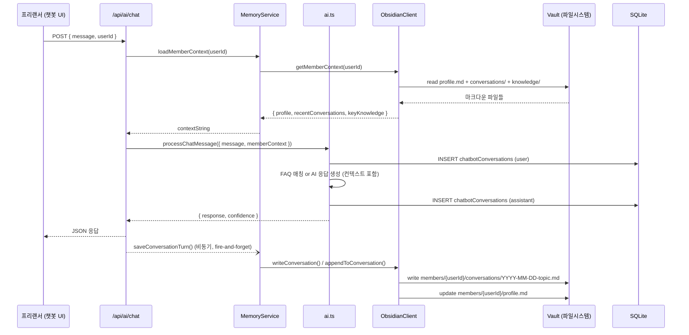

# Design: Obsidian Memory System

> 옵시디언 CLI 기반 회원(프리랜서)별 대화 메모리 관리 시스템 상세 설계서
>
> Plan 문서: `docs/01-plan/features/obsidian-memory-system.plan.md`

## 1. 구현 순서

```
Phase 1 (MVP)                    Phase 2                      Phase 3
─────────────                    ───────                      ───────
1. types.ts                      7. extractor.ts              11. briefing.ts
2. templates.ts                  8. prompts.ts                12. aggregator.ts
3. client.ts                     9. queue.ts                  13. handoff.ts
4. search.ts                     10. /admin/knowledge UI      14. /admin/briefing UI
5. memory-service.ts                                          15. lifecycle.ts
6. /api/ai/chat 확장
```

## 2. 파일 구조

```
choi-pd-ecosystem/
├── src/lib/obsidian/
│   ├── types.ts              ← 모든 타입 정의
│   ├── templates.ts          ← 마크다운 템플릿 생성
│   ├── client.ts             ← Vault 파일 CRUD (단일 진입점)
│   ├── search.ts             ← frontmatter 파싱 + 전문 검색
│   ├── memory-service.ts     ← ai.ts 연동 메모리 레이어
│   ├── extractor.ts          ← LLM 지식 추출 (Phase 2)
│   ├── prompts.ts            ← 추출용 프롬프트 (Phase 2)
│   ├── queue.ts              ← 비동기 쓰기 큐 (Phase 2)
│   ├── briefing.ts           ← 온보딩 브리핑 생성 (Phase 3)
│   ├── aggregator.ts         ← 프로젝트별 지식 집계 (Phase 3)
│   ├── handoff.ts            ← 핸드오프 처리 (Phase 3)
│   └── lifecycle.ts          ← 만료/감쇠 관리 (Phase 3)
│
├── src/app/api/
│   ├── ai/chat/route.ts      ← 기존 확장 (메모리 연동)
│   ├── admin/knowledge/
│   │   └── route.ts          ← 지식 리뷰 API (Phase 2)
│   └── admin/briefing/
│       └── route.ts          ← 브리핑 생성 API (Phase 3)
│
├── src/app/admin/
│   ├── knowledge/page.tsx    ← 지식 리뷰 UI (Phase 2)
│   └── briefing/page.tsx     ← 브리핑 UI (Phase 3)
│
├── scripts/
│   └── init-vault.ts         ← Vault 초기화 CLI 스크립트
│
└── data/
    └── obsidian-vault/       ← 기본 Vault 위치 (gitignore)
        ├── _system/
        ├── organization/
        ├── members/
        └── projects/
```

## 3. 타입 정의 (`types.ts`)

```typescript
// ============================================================
// Vault Configuration
// ============================================================

export interface VaultConfig {
  basePath: string;           // Vault 루트 경로
  autoCreateMember: boolean;  // 신규 회원 자동 프로필 생성
  maxConversationsPerDay: number; // 일일 대화 파일 최대 수
}

// ============================================================
// Member (회원/프리랜서)
// ============================================================

export interface MemberProfile {
  id: string;
  name: string;
  role: string;
  type: 'freelancer' | 'employee' | 'partner';
  status: 'active' | 'inactive' | 'archived';
  projects: string[];
  tags: string[];
  created: string;            // ISO date
  lastConversation: string;   // ISO date
  totalConversations: number;
  totalKnowledgeItems: number;
}

// ============================================================
// Conversation (대화 기록)
// ============================================================

export interface ConversationEntry {
  memberId: string;
  sessionId: string;
  date: string;               // YYYY-MM-DD
  topic: string;
  tags: string[];
  messages: ConversationMessage[];
  knowledgeExtracted: boolean;
  relatedKnowledge: string[]; // 관련 knowledge 파일 경로
}

export interface ConversationMessage {
  role: 'user' | 'assistant' | 'system';
  content: string;
  timestamp: string;          // ISO datetime
  intent?: string;
  metadata?: Record<string, unknown>;
}

// ============================================================
// Knowledge (추출된 지식)
// ============================================================

export type KnowledgeCategory =
  | 'decision'     // 의사결정 기록
  | 'expertise'    // 전문 지식/노하우
  | 'process'      // 작업 절차
  | 'issue'        // 문제/해결 기록
  | 'preference';  // 선호/스타일

export interface KnowledgeItem {
  memberId: string;
  category: KnowledgeCategory;
  title: string;
  content: string;
  confidence: number;          // 0.0 ~ 1.0
  sourceConversation: string;  // 대화 파일 경로
  created: string;
  validUntil: string | null;   // null = 영구
  supersedes: string | null;   // 이전 버전 대체 시 경로
  tags: string[];
  reviewStatus: 'pending' | 'approved' | 'rejected';
}

// ============================================================
// Briefing (온보딩 브리핑)
// ============================================================

export interface BriefingRequest {
  projectId: string;
  targetMemberId?: string;     // 특정 회원용 브리핑
  includeCategories?: KnowledgeCategory[];
  maxItems?: number;
}

export interface BriefingDocument {
  projectId: string;
  generatedAt: string;
  sections: BriefingSection[];
  sourceCount: number;
}

export interface BriefingSection {
  title: string;
  category: KnowledgeCategory;
  items: KnowledgeItem[];
}

// ============================================================
// Search
// ============================================================

export interface VaultSearchOptions {
  query: string;
  memberId?: string;           // 특정 회원 범위 한정
  category?: KnowledgeCategory;
  dateFrom?: string;
  dateTo?: string;
  limit?: number;
}

export interface VaultSearchResult {
  filePath: string;
  score: number;
  excerpt: string;
  frontmatter: Record<string, unknown>;
}
```

## 4. Obsidian CLI Client (`client.ts`) 상세 설계

```typescript
import { promises as fs } from 'fs';
import path from 'path';
import matter from 'gray-matter';
import type {
  VaultConfig,
  MemberProfile,
  ConversationEntry,
  KnowledgeItem,
} from './types';
import { renderConversation, renderKnowledge, renderProfile } from './templates';

const DEFAULT_CONFIG: VaultConfig = {
  basePath: process.env.OBSIDIAN_VAULT_PATH || './data/obsidian-vault',
  autoCreateMember: true,
  maxConversationsPerDay: 50,
};

export class ObsidianClient {
  private config: VaultConfig;
  private writeQueue: Promise<void> = Promise.resolve();

  constructor(config?: Partial<VaultConfig>) {
    this.config = { ...DEFAULT_CONFIG, ...config };
  }

  // ── 경로 헬퍼 ──────────────────────────────────

  private memberDir(memberId: string): string {
    return path.join(this.config.basePath, 'members', memberId);
  }

  private conversationPath(memberId: string, date: string, topic: string): string {
    const slug = topic.replace(/[^a-zA-Z0-9가-힣]/g, '-').toLowerCase();
    return path.join(this.memberDir(memberId), 'conversations', `${date}-${slug}.md`);
  }

  private knowledgePath(memberId: string, category: string, title: string): string {
    const slug = title.replace(/[^a-zA-Z0-9가-힣]/g, '-').toLowerCase();
    return path.join(this.memberDir(memberId), 'knowledge', `${category}-${slug}.md`);
  }

  // ── 큐 기반 순차 쓰기 ──────────────────────────

  private enqueueWrite(fn: () => Promise<void>): Promise<void> {
    this.writeQueue = this.writeQueue.then(fn).catch(console.error);
    return this.writeQueue;
  }

  // ── Vault 초기화 ───────────────────────────────

  async initVault(): Promise<void> {
    const dirs = [
      '_system/templates',
      'organization',
      'members',
      'projects',
    ];
    for (const dir of dirs) {
      await fs.mkdir(path.join(this.config.basePath, dir), { recursive: true });
    }
  }

  // ── 회원 프로필 ────────────────────────────────

  async getMemberProfile(memberId: string): Promise<MemberProfile | null> {
    const profilePath = path.join(this.memberDir(memberId), 'profile.md');
    try {
      const content = await fs.readFile(profilePath, 'utf-8');
      const { data } = matter(content);
      return data as MemberProfile;
    } catch {
      return null;
    }
  }

  async createMemberProfile(profile: MemberProfile): Promise<void> {
    const dir = this.memberDir(profile.id);
    await fs.mkdir(path.join(dir, 'conversations'), { recursive: true });
    await fs.mkdir(path.join(dir, 'knowledge'), { recursive: true });
    await fs.mkdir(path.join(dir, 'decisions'), { recursive: true });

    const content = renderProfile(profile);
    await fs.writeFile(path.join(dir, 'profile.md'), content, 'utf-8');
  }

  async updateMemberProfile(memberId: string, updates: Partial<MemberProfile>): Promise<void> {
    const profile = await this.getMemberProfile(memberId);
    if (!profile) throw new Error(`Member not found: ${memberId}`);

    const merged = { ...profile, ...updates };
    const content = renderProfile(merged);
    await fs.writeFile(
      path.join(this.memberDir(memberId), 'profile.md'),
      content,
      'utf-8'
    );
  }

  // ── 대화 기록 ──────────────────────────────────

  async writeConversation(entry: ConversationEntry): Promise<string> {
    // 회원 프로필 자동 생성
    if (this.config.autoCreateMember) {
      const exists = await this.getMemberProfile(entry.memberId);
      if (!exists) {
        await this.createMemberProfile({
          id: entry.memberId,
          name: entry.memberId,
          role: 'unknown',
          type: 'freelancer',
          status: 'active',
          projects: [],
          tags: [],
          created: new Date().toISOString().split('T')[0],
          lastConversation: entry.date,
          totalConversations: 0,
          totalKnowledgeItems: 0,
        });
      }
    }

    const filePath = this.conversationPath(entry.memberId, entry.date, entry.topic);
    const content = renderConversation(entry);

    return this.enqueueWrite(async () => {
      await fs.mkdir(path.dirname(filePath), { recursive: true });
      await fs.writeFile(filePath, content, 'utf-8');

      // 프로필 업데이트
      await this.updateMemberProfile(entry.memberId, {
        lastConversation: entry.date,
        totalConversations: ((await this.getMemberProfile(entry.memberId))?.totalConversations || 0) + 1,
      });
    }).then(() => filePath);
  }

  async appendToConversation(filePath: string, message: ConversationMessage): Promise<void> {
    return this.enqueueWrite(async () => {
      const existing = await fs.readFile(filePath, 'utf-8');
      const roleLabel = message.role === 'user' ? '**사용자**' : '**AI**';
      const appendLine = `\n${roleLabel} (${message.timestamp}):\n${message.content}\n`;
      await fs.writeFile(filePath, existing + appendLine, 'utf-8');
    });
  }

  // ── 지식 항목 ──────────────────────────────────

  async writeKnowledge(item: KnowledgeItem): Promise<string> {
    const filePath = this.knowledgePath(item.memberId, item.category, item.title);
    const content = renderKnowledge(item);

    return this.enqueueWrite(async () => {
      await fs.mkdir(path.dirname(filePath), { recursive: true });
      await fs.writeFile(filePath, content, 'utf-8');

      await this.updateMemberProfile(item.memberId, {
        totalKnowledgeItems: ((await this.getMemberProfile(item.memberId))?.totalKnowledgeItems || 0) + 1,
      });
    }).then(() => filePath);
  }

  // ── 회원 컨텍스트 로드 (챗봇용) ─────────────────

  async getMemberContext(memberId: string): Promise<{
    profile: MemberProfile | null;
    recentConversations: string[];
    keyKnowledge: string[];
  }> {
    const profile = await this.getMemberProfile(memberId);
    if (!profile) return { profile: null, recentConversations: [], keyKnowledge: [] };

    // 최근 대화 5건 로드
    const convDir = path.join(this.memberDir(memberId), 'conversations');
    let convFiles: string[] = [];
    try {
      const files = await fs.readdir(convDir);
      convFiles = files
        .filter(f => f.endsWith('.md'))
        .sort()
        .reverse()
        .slice(0, 5);
    } catch { /* 폴더 없으면 빈 배열 */ }

    const recentConversations: string[] = [];
    for (const file of convFiles) {
      const content = await fs.readFile(path.join(convDir, file), 'utf-8');
      const { data } = matter(content);
      recentConversations.push(`[${data.date}] ${data.topic}`);
    }

    // 핵심 지식 로드
    const knowledgeDir = path.join(this.memberDir(memberId), 'knowledge');
    let knowledgeFiles: string[] = [];
    try {
      const files = await fs.readdir(knowledgeDir);
      knowledgeFiles = files.filter(f => f.endsWith('.md'));
    } catch { /* 폴더 없으면 빈 배열 */ }

    const keyKnowledge: string[] = [];
    for (const file of knowledgeFiles) {
      const content = await fs.readFile(path.join(knowledgeDir, file), 'utf-8');
      const { data, content: body } = matter(content);
      if (data.reviewStatus !== 'rejected') {
        keyKnowledge.push(`[${data.category}] ${body.trim().slice(0, 200)}`);
      }
    }

    return { profile, recentConversations, keyKnowledge };
  }

  // ── 회원 목록 ──────────────────────────────────

  async listMembers(filter?: { status?: string }): Promise<MemberProfile[]> {
    const membersDir = path.join(this.config.basePath, 'members');
    const dirs = await fs.readdir(membersDir);
    const profiles: MemberProfile[] = [];

    for (const dir of dirs) {
      const profile = await this.getMemberProfile(dir);
      if (profile) {
        if (filter?.status && profile.status !== filter.status) continue;
        profiles.push(profile);
      }
    }
    return profiles;
  }
}
```

## 5. Templates (`templates.ts`) 상세 설계

```typescript
import type { MemberProfile, ConversationEntry, KnowledgeItem } from './types';

export function renderProfile(profile: MemberProfile): string {
  return `---
id: "${profile.id}"
name: "${profile.name}"
role: "${profile.role}"
type: "${profile.type}"
status: "${profile.status}"
projects: ${JSON.stringify(profile.projects)}
tags: ${JSON.stringify(profile.tags)}
created: ${profile.created}
lastConversation: ${profile.lastConversation}
totalConversations: ${profile.totalConversations}
totalKnowledgeItems: ${profile.totalKnowledgeItems}
---

## ${profile.name}

- **역할**: ${profile.role}
- **유형**: ${profile.type}
- **상태**: ${profile.status}
`;
}

export function renderConversation(entry: ConversationEntry): string {
  const frontmatter = `---
member_id: "${entry.memberId}"
session_id: "${entry.sessionId}"
date: ${entry.date}
topic: "${entry.topic}"
tags: ${JSON.stringify(entry.tags)}
knowledge_extracted: ${entry.knowledgeExtracted}
related: ${JSON.stringify(entry.relatedKnowledge)}
---`;

  const messages = entry.messages.map(m => {
    const roleLabel = m.role === 'user' ? '**사용자**' : '**AI**';
    return `${roleLabel} (${m.timestamp}):\n${m.content}`;
  }).join('\n\n---\n\n');

  return `${frontmatter}\n\n# ${entry.topic}\n\n${messages}\n`;
}

export function renderKnowledge(item: KnowledgeItem): string {
  return `---
member_id: "${item.memberId}"
category: "${item.category}"
confidence: ${item.confidence}
source_conversation: "${item.sourceConversation}"
created: ${item.created}
valid_until: ${item.validUntil ? `"${item.validUntil}"` : 'null'}
supersedes: ${item.supersedes ? `"${item.supersedes}"` : 'null'}
tags: ${JSON.stringify(item.tags)}
review_status: "${item.reviewStatus}"
---

# ${item.title}

${item.content}
`;
}
```

## 6. Search (`search.ts`) 상세 설계

```typescript
import { promises as fs } from 'fs';
import path from 'path';
import matter from 'gray-matter';
import type { VaultSearchOptions, VaultSearchResult } from './types';

export class VaultSearch {
  constructor(private basePath: string) {}

  async search(options: VaultSearchOptions): Promise<VaultSearchResult[]> {
    const { query, memberId, category, dateFrom, dateTo, limit = 20 } = options;
    const results: VaultSearchResult[] = [];

    // 검색 범위 결정
    const searchDir = memberId
      ? path.join(this.basePath, 'members', memberId)
      : this.basePath;

    const files = await this.walkDir(searchDir);
    const queryLower = query.toLowerCase();

    for (const filePath of files) {
      if (!filePath.endsWith('.md')) continue;

      const content = await fs.readFile(filePath, 'utf-8');
      const { data: frontmatter, content: body } = matter(content);

      // frontmatter 필터
      if (category && frontmatter.category !== category) continue;
      if (dateFrom && frontmatter.date && frontmatter.date < dateFrom) continue;
      if (dateTo && frontmatter.date && frontmatter.date > dateTo) continue;

      // 전문 검색 (키워드 매칭)
      const bodyLower = body.toLowerCase();
      if (!bodyLower.includes(queryLower)) continue;

      // 스코어 계산
      const occurrences = bodyLower.split(queryLower).length - 1;
      const score = occurrences / Math.max(body.length / 100, 1);

      // excerpt 추출
      const idx = bodyLower.indexOf(queryLower);
      const start = Math.max(0, idx - 50);
      const end = Math.min(body.length, idx + queryLower.length + 50);
      const excerpt = body.slice(start, end).replace(/\n/g, ' ');

      results.push({
        filePath: path.relative(this.basePath, filePath),
        score,
        excerpt: `...${excerpt}...`,
        frontmatter,
      });
    }

    return results
      .sort((a, b) => b.score - a.score)
      .slice(0, limit);
  }

  private async walkDir(dir: string): Promise<string[]> {
    const entries = await fs.readdir(dir, { withFileTypes: true });
    const files: string[] = [];
    for (const entry of entries) {
      const fullPath = path.join(dir, entry.name);
      if (entry.name.startsWith('.') || entry.name.startsWith('_')) continue;
      if (entry.isDirectory()) {
        files.push(...await this.walkDir(fullPath));
      } else {
        files.push(fullPath);
      }
    }
    return files;
  }
}
```

## 7. Memory Service (`memory-service.ts`) 상세 설계

```typescript
import { ObsidianClient } from './client';
import type { ConversationMessage, ConversationEntry } from './types';

// 싱글턴 인스턴스
let clientInstance: ObsidianClient | null = null;

function getClient(): ObsidianClient {
  if (!clientInstance) {
    clientInstance = new ObsidianClient();
  }
  return clientInstance;
}

// 세션별 진행 중인 대화 추적
const activeSessions = new Map<string, {
  memberId: string;
  filePath: string | null;
  messages: ConversationMessage[];
  topic: string;
}>();

/**
 * 대화 시작 전 회원 컨텍스트 로드
 * → processChatMessage() 호출 전에 실행
 */
export async function loadMemberContext(userId: string): Promise<string> {
  const client = getClient();
  const ctx = await client.getMemberContext(userId);

  if (!ctx.profile) {
    return '(신규 사용자 - 이전 대화 없음)';
  }

  let contextStr = `## 사용자 컨텍스트: ${ctx.profile.name}\n`;
  contextStr += `- 역할: ${ctx.profile.role}\n`;
  contextStr += `- 프로젝트: ${ctx.profile.projects.join(', ')}\n\n`;

  if (ctx.recentConversations.length > 0) {
    contextStr += `### 최근 대화\n`;
    ctx.recentConversations.forEach(c => {
      contextStr += `- ${c}\n`;
    });
    contextStr += '\n';
  }

  if (ctx.keyKnowledge.length > 0) {
    contextStr += `### 핵심 지식\n`;
    ctx.keyKnowledge.forEach(k => {
      contextStr += `- ${k}\n`;
    });
  }

  return contextStr;
}

/**
 * 대화 메시지 저장
 * → processChatMessage() 응답 후 호출
 */
export async function saveConversationTurn(params: {
  sessionId: string;
  memberId: string;
  userMessage: string;
  assistantResponse: string;
  intent?: string;
  metadata?: Record<string, unknown>;
}): Promise<void> {
  const { sessionId, memberId, userMessage, assistantResponse, intent, metadata } = params;
  const client = getClient();
  const now = new Date();
  const dateStr = now.toISOString().split('T')[0];

  // 세션 첫 메시지면 새 대화 파일 생성
  if (!activeSessions.has(sessionId)) {
    // 토픽 자동 생성 (첫 메시지 앞 20자)
    const topic = userMessage.slice(0, 30).replace(/\s+/g, ' ').trim();

    const entry: ConversationEntry = {
      memberId,
      sessionId,
      date: dateStr,
      topic,
      tags: [],
      messages: [
        { role: 'user', content: userMessage, timestamp: now.toISOString(), intent },
        { role: 'assistant', content: assistantResponse, timestamp: now.toISOString(), metadata },
      ],
      knowledgeExtracted: false,
      relatedKnowledge: [],
    };

    const filePath = await client.writeConversation(entry);
    activeSessions.set(sessionId, { memberId, filePath, messages: entry.messages, topic });
  } else {
    // 기존 세션에 메시지 추가
    const session = activeSessions.get(sessionId)!;
    const userMsg: ConversationMessage = {
      role: 'user', content: userMessage, timestamp: now.toISOString(), intent,
    };
    const assistantMsg: ConversationMessage = {
      role: 'assistant', content: assistantResponse, timestamp: now.toISOString(), metadata,
    };

    if (session.filePath) {
      await client.appendToConversation(session.filePath, userMsg);
      await client.appendToConversation(session.filePath, assistantMsg);
    }
    session.messages.push(userMsg, assistantMsg);
  }
}

/**
 * 세션 종료 시 정리
 */
export function endSession(sessionId: string): void {
  activeSessions.delete(sessionId);
}
```

## 8. `/api/ai/chat/route.ts` 확장 설계

기존 코드와의 변경점만 표시:

```typescript
// 추가 import
import { loadMemberContext, saveConversationTurn } from '@/lib/obsidian/memory-service';

export async function POST(request: NextRequest) {
  try {
    const body = await request.json();
    const { message, sessionId, userId, userType } = body;

    // ... 기존 validation 유지 ...

    const finalSessionId = sessionId || nanoid();
    const finalUserType = userType || 'anonymous';

    // ★ NEW: 회원 컨텍스트 로드 (userId가 있을 때만)
    let memberContext: string | undefined;
    if (userId) {
      memberContext = await loadMemberContext(userId);
    }

    // 기존 processChatMessage에 컨텍스트 전달
    const result = await processChatMessage({
      message,
      sessionId: finalSessionId,
      userId,
      userType: finalUserType,
      memberContext,  // ★ NEW 파라미터
    });

    // ★ NEW: 대화를 Vault에 비동기 저장 (응답 지연 없이)
    if (userId) {
      saveConversationTurn({
        sessionId: finalSessionId,
        memberId: userId,
        userMessage: message,
        assistantResponse: result.response,
        intent: result.matchedFaqId ? 'faq' : 'general',
        metadata: { confidence: result.confidence, matchedFaqId: result.matchedFaqId },
      }).catch(err => console.error('Memory save error:', err));
    }

    return NextResponse.json({
      success: true,
      data: {
        response: result.response,
        sessionId: finalSessionId,
        matchedFaqId: result.matchedFaqId,
        confidence: result.confidence,
      },
    });
  } catch (error: any) {
    // ... 기존 에러 핸들링 유지 ...
  }
}
```

## 9. `ai.ts` → `processChatMessage()` 변경 설계

최소한의 수정으로 memberContext를 기존 흐름에 주입:

```typescript
// 파라미터 타입에 memberContext 추가
export async function processChatMessage(params: {
  message: string;
  sessionId: string;
  userId?: string;
  userType: 'distributor' | 'pd' | 'customer' | 'anonymous';
  memberContext?: string;  // ★ NEW
}): Promise<{ response: string; matchedFaqId?: number; confidence: number }> {
  const { message, sessionId, userId, userType, memberContext } = params;

  // 기존 DB 저장 유지
  await db.insert(chatbotConversations).values({
    sessionId,
    userId: userId || null,
    userType,
    role: 'user',
    message,
  });

  // 기존 FAQ 매칭 로직 유지 ...

  // AI 응답 생성 시 memberContext 전달
  if (!bestMatch || bestScore <= 0.6) {
    response = await generateChatbotResponse(message, sessionId, memberContext); // ★ memberContext 추가
    confidence = 0.5;
  }

  // 기존 응답 저장 유지 ...
}
```

## 10. Vault 초기화 스크립트 (`scripts/init-vault.ts`)

```typescript
#!/usr/bin/env tsx
/**
 * Obsidian Vault 초기화 스크립트
 * 실행: npx tsx scripts/init-vault.ts [vault-path]
 */

import { ObsidianClient } from '../src/lib/obsidian/client';
import { promises as fs } from 'fs';
import path from 'path';

async function main() {
  const vaultPath = process.argv[2] || './data/obsidian-vault';

  console.log(`Initializing Obsidian vault at: ${vaultPath}`);

  const client = new ObsidianClient({ basePath: vaultPath });
  await client.initVault();

  // _system/config.md 생성
  const configContent = `---
vault_name: "imPD Memory Vault"
created: ${new Date().toISOString().split('T')[0]}
version: "1.0.0"
---

# imPD Memory Vault 설정

- **용도**: 회원(프리랜서)별 대화 메모리 관리
- **자동 생성**: 챗봇 대화 시 회원 프로필 및 대화 기록 자동 생성
`;

  await fs.writeFile(
    path.join(vaultPath, '_system', 'config.md'),
    configContent,
    'utf-8'
  );

  // organization 기본 파일
  await fs.writeFile(
    path.join(vaultPath, 'organization', 'brand-guidelines.md'),
    `---\ntitle: "브랜드 가이드라인"\nupdated: ${new Date().toISOString().split('T')[0]}\n---\n\n# 브랜드 가이드라인\n\n(조직 공통 지식을 여기에 기록)\n`,
    'utf-8'
  );

  // .gitignore (개인정보 보호)
  await fs.writeFile(
    path.join(vaultPath, '.gitignore'),
    `# 회원 대화 기록은 git에 포함하지 않음\nmembers/*/conversations/\n# 프로필은 포함 (메타데이터만)\n!members/*/profile.md\n`,
    'utf-8'
  );

  console.log('Vault initialized successfully!');
  console.log(`  - _system/config.md`);
  console.log(`  - organization/brand-guidelines.md`);
  console.log(`  - .gitignore`);
}

main().catch(console.error);
```

## 11. 환경변수

```env
# .env에 추가
OBSIDIAN_VAULT_PATH=./data/obsidian-vault
```

## 12. 의존성 추가

```json
{
  "dependencies": {
    "gray-matter": "^4.0.3"
  }
}
```

기존 `nanoid`는 이미 설치됨. `gray-matter`만 추가.

## 13. Phase 2 설계 미리보기: Knowledge Extractor

```typescript
// src/lib/obsidian/extractor.ts (Phase 2에서 구현)

/**
 * LLM에게 대화 내용을 분석하여 지식 추출 요청
 *
 * 프롬프트 전략:
 * 1. 대화 전체를 LLM에 전달
 * 2. "이 대화에서 장기적으로 기억할 가치가 있는 정보를 추출하세요"
 * 3. 카테고리(decision/expertise/process/issue/preference) 분류 요청
 * 4. confidence score와 함께 JSON 반환
 * 5. confidence > 0.7인 항목만 vault에 저장
 */
export async function extractKnowledge(
  conversation: ConversationMessage[]
): Promise<KnowledgeItem[]> {
  // Phase 2에서 구현
}
```

## 14. Phase 3 설계 미리보기: Briefing Generator

```typescript
// src/lib/obsidian/briefing.ts (Phase 3에서 구현)

/**
 * 프로젝트별 축적된 지식을 집계하여 온보딩 브리핑 생성
 *
 * 로직:
 * 1. 프로젝트에 참여한 모든 회원의 knowledge/ 폴더 스캔
 * 2. category별로 그룹화
 * 3. LLM으로 요약 및 정리
 * 4. 브리핑 마크다운 문서 생성
 */
export async function generateBriefing(
  request: BriefingRequest
): Promise<BriefingDocument> {
  // Phase 3에서 구현
}
```

## 15. 데이터 흐름 다이어그램



## 16. 체크리스트 (구현 시 참조)

### Phase 1 완료 기준
- [ ] `npm install gray-matter` 완료
- [ ] `src/lib/obsidian/types.ts` 타입 정의
- [ ] `src/lib/obsidian/templates.ts` 마크다운 렌더링
- [ ] `src/lib/obsidian/client.ts` Vault CRUD + 큐 기반 쓰기
- [ ] `src/lib/obsidian/search.ts` 전문 검색
- [ ] `src/lib/obsidian/memory-service.ts` 메모리 레이어
- [ ] `/api/ai/chat/route.ts` 확장 (컨텍스트 로드 + 대화 저장)
- [ ] `ai.ts` processChatMessage에 memberContext 파라미터 추가
- [ ] `scripts/init-vault.ts` Vault 초기화 스크립트
- [ ] `.env`에 `OBSIDIAN_VAULT_PATH` 추가
- [ ] `data/obsidian-vault/`을 `.gitignore`에 추가
- [ ] 통합 테스트: 챗봇 대화 → vault 파일 생성 확인
